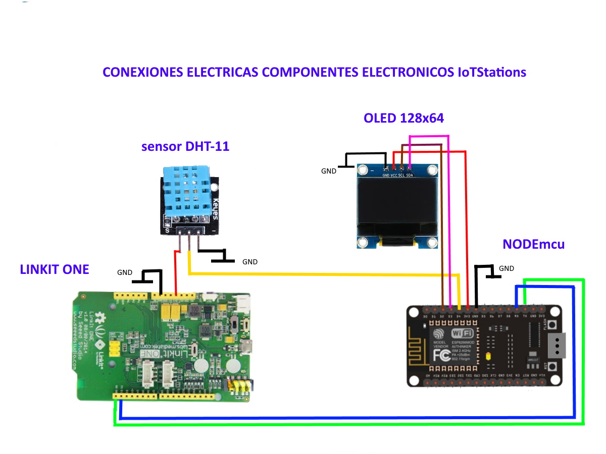

# IoT Stations (Hardware)  

Codigos de programacion para dispositivos embebidos. Se usa Linkit One la cual captura coordenadas geograficas, nivel de bateria y estado de conexion; estos datos son enviados a una placa NodeMCU a través del puerto serial, esta ultima placa se encarga de publicar los datos en el modulo de RealTime database de firebase.

## Diagrama de componentes

   
 

